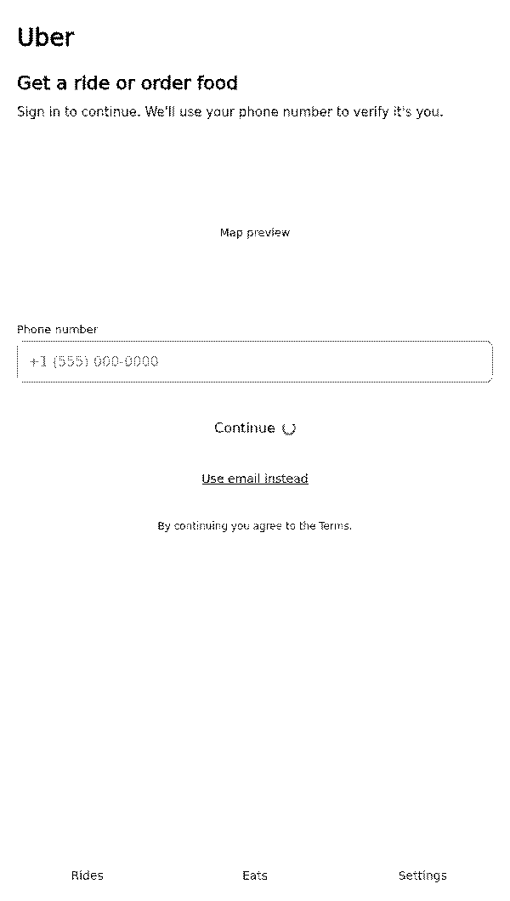
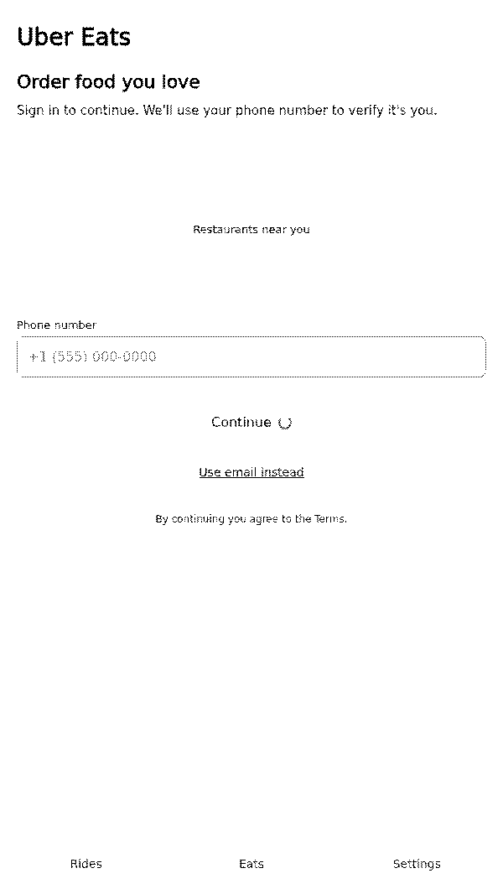
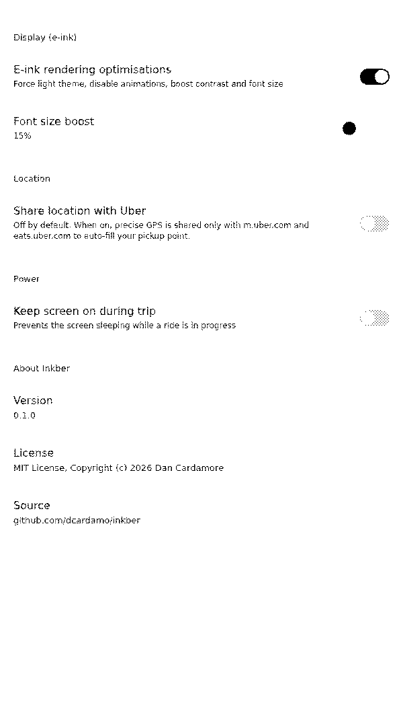

# Inkber

An Uber Rides + Uber Eats WebView for E-Ink phones, optimised for the
[Mudita Kompakt](https://mudita.com/products/phones/mudita-kompakt/).

The Kompakt has no built-in browser, and Uber has no e-ink client. Inkber wraps
Uber's mobile web app (`m.uber.com` for Rides, `ubereats.com` for Eats) in a
minimal Android WebView with rendering tuned for a 4.3" E Ink Carta panel:
forced light theme, no animations, boosted contrast and font size, grayscale-
safe decorative elements, and blocked ad/tracker/autoplay resources. Location
sharing is **off by default** and opt-in, shared only with Uber's domains.

<p align="center">
  
  
  
</p>

> **Note on screenshots:** rendered via headless Chromium and post-processed
> with ImageMagick to approximate the Mudita Kompakt's E Ink display. They are
> representative, not pixel-exact device captures. Real device screenshots are
> welcome — drop them into `docs/screenshots/` using the same filenames.

---

## Features

| Feature                     | What it does                                                                 |
|-----------------------------|------------------------------------------------------------------------------|
| Rides + Eats in one app     | Bottom toggle bar switches between `m.uber.com` and `ubereats.com`.          |
| E-ink rendering mode        | Forces light theme, disables animations/transitions, boosts contrast + font. |
| Grayscale-safe decoration   | Desaturates decorative colour elements; leaves map tiles and route overlays intact. |
| Ad / tracker / autoplay block | Known ad and tracker hosts are blocked at the resource-request layer.     |
| Optional location sharing   | Off by default. Opt-in dialog on first launch; shared only with Uber domains. |
| Keep screen on during trips | Optional; prevents the screen sleeping while a ride is in progress.        |
| Back button = WebView back  | Navigates WebView history before exiting the app.                           |
| No telemetry                | The app makes no requests of its own. Only Uber's web pages load.          |
| Software rendering          | Avoids the ghosting artefacts hardware layers cause on E Ink panels.        |
| MIT licensed                | Free for anyone to use, modify, and redistribute.                          |

## Install

### Via Obtainium (recommended for Mudita Kompakt)

[Obtainium](https://github.com/ImranR98/Obtainium) installs apps directly from
GitHub Releases. In Obtainium, add a new app with these settings:

| Setting             | Value                              |
|---------------------|------------------------------------|
| App URL             | `https://github.com/dcardamo/inkber` |
| Release source      | GitHub Releases                    |
| Version source      | Tags                               |
| APK filter          | `inkber.*\.apk`                    |

Obtainium will track new tags and offer updates automatically. The APK is
unsigned; Android will prompt you once to allow installs from the source
you used to fetch it (e.g. Obtainium or your file manager).

### Via APK from GitHub Releases

1. Go to [Releases](https://github.com/dcardamo/inkber/releases).
2. Download the latest `inkber-vX.Y.Z.apk`.
3. Sideload it on the Kompakt (Settings → Security → allow unknown sources,
   then open the APK with a file manager).

## Building from source

This repo ships a [Nix flake](flake.nix) that provides the Android SDK, JDK,
Gradle, and screenshot tooling. On NixOS (or any machine with Nix installed):

```sh
# Accept the Android SDK license (one-time, per shell invocation):
export NIXPKGS_ACCEPT_ANDROID_SDK_LICENSE=1

# Enter the dev shell:
nix develop --impure

# Build the debug APK:
./gradlew assembleDebug

# Run unit + Robolectric tests:
./gradlew testDebug

# Regenerate README screenshots:
./tools/make-screenshots.sh
```

The debug APK is written to
`app/build/outputs/apk/debug/app-debug.apk`.

### Creating a release

CI automatically builds and attaches an unsigned APK to a GitHub Release when
you push a tag:

```sh
git tag v0.1.0
git push origin v0.1.0
```

The release workflow (`.github/workflows/release.yml`) produces
`inkber-v0.1.0.apk` and a `.sha256` checksum.

## Privacy

Inkber is privacy-first, designed for a phone built around minimising data
sharing.

- **No telemetry.** The app itself makes no network requests. Only Uber's web
  pages load, exactly as they would in a browser.
- **Location is opt-in.** The `ACCESS_FINE_LOCATION` permission is declared but
  not requested on launch. A first-run dialog explains *why* location helps
  Uber (auto pickup point, accurate ETAs, faster driver matching) and offers
  three choices: **Allow**, **Not now**, and **Don't ask again**. Choosing
  Allow triggers the standard Android permission dialog.
- **Location is domain-scoped.** When granted, geolocation is shared only with
  `m.uber.com` and `eats.uber.com` origins — the `WebChromeClient` denies
  geolocation for any other origin. See `UberWebChromeClient.kt`.
- **Other browser permissions are denied.** Camera, microphone, and sensor
  permission requests from web pages are denied by default; Uber's mobile web
  doesn't need them for rides or eats ordering.
- **No ads or trackers.** Known ad and tracker hosts are blocked at the
  resource-request layer. See `EinkInjector.BLOCKED_HOSTS`.
- **Backups.** Only your Inkber settings (toggles, font boost %, location opt-in
  state) are backed up — never cookies or browsing history.

## How it works

```
m.uber.com / ubereats.com
        │
        ▼
   UberWebView        ── software layer, no animations, mobile UA
        │
        ▼
  UberWebViewClient   ── blocks ad hosts, keeps Uber domains in-app,
        │                 injects EinkInjector.css() after page load
        ▼
  UberWebChromeClient ── gates geolocation to Uber domains only,
                         denies camera/mic/sensor permission requests
        │
        ▼
   MainActivity       ── Rides | Eats | Settings toggle, back-button
                         WebView history, keep-screen-on during trips
```

The e-ink CSS is generated by `EinkInjector.css()` and injected after each
page load via `WebView.evaluateJavascript()`. It is kept as a pure-Kotlin
object (no Android imports) so it is unit-testable on the JVM — see
`EinkInjectorTest.kt` (14 tests) and the Robolectric tests in `PrefsTest.kt`
and `UberWebChromeClientTest.kt`.

## Testing

- **Unit tests (JVM):** `EinkInjector` CSS generation, URL allow/block lists,
  location-hook script, location-prompt state machine, prefs persistence.
- **Robolectric tests (JVM, Android-shadowed):** `Prefs` SharedPreferences
  state machine, `UberWebChromeClient` geolocation gating.
- **CI:** `.github/workflows/ci.yml` runs `./gradlew assembleDebug testDebug`
  via the Nix flake on every push and PR.

Run locally:

```sh
./gradlew testDebug
```

23 tests, 0 failures at time of writing.

## Project layout

```
inkber/
├── flake.nix                  # Nix devshell: Android SDK, JDK 17, Gradle, Chromium, ImageMagick
├── app/
│   ├── build.gradle.kts
│   └── src/
│       ├── main/
│       │   ├── AndroidManifest.xml
│       │   ├── java/com/dan/inkber/
│       │   │   ├── MainActivity.kt          # toggle bar, back-nav, permission flow, keep-screen-on
│       │   │   ├── UberWebView.kt           # WebView configured for e-ink (software layer, mobile UA)
│       │   │   ├── UberWebViewClient.kt     # blocks ads, keeps Uber in-app, injects e-ink CSS
│       │   │   ├── UberWebChromeClient.kt   # gates geolocation to Uber domains, denies camera/mic
│       │   │   ├── LocationProvider.kt      # passive last-known GPS via LocationManager (no Play Services)
│       │   │   ├── Prefs.kt                 # typed SharedPreferences accessor with privacy-first defaults
│       │   │   ├── SettingsActivity.kt      # e-ink, location, power, about settings
│       │   │   └── EinkInjector.kt          # CSS/JS generation (pure Kotlin, unit-tested)
│       │   └── res/                         # layouts, strings, themes, drawables, preferences.xml
│       └── test/java/com/dan/inkber/        # unit + Robolectric tests + screenshot fixture dump
├── docs/screenshots/                        # README screenshots (e-ink-post-processed)
├── tools/make-screenshots.sh                # headless Chromium + ImageMagick screenshot pipeline
└── .github/workflows/                       # ci.yml (build+test), release.yml (unsigned APK on tag)
```

## Acknowledgements

Inspired by [blib85/rideshare](https://github.com/blib85/rideshare), a simple
Uber WebView for the Mudita Kompakt. That repository has no license, so Inkber
is an independent implementation written from scratch under the MIT license.

## License

MIT — see [LICENSE](LICENSE). Copyright (c) 2026 Dan Cardamore.